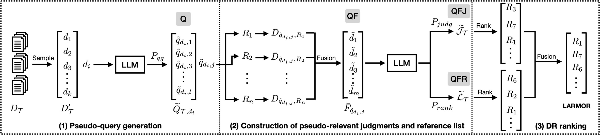

# LARMOR: Leveraging LLMs for Unsupervised Dense Retriever Ranking



This is the official repository for SIGIR2024 paper "[Leveraging LLMs for Unsupervised Dense Retriever Ranking](https://arxiv.org/pdf/2402.04853.pdf)", Ekaterina Khramtsova, Shengyao Zhuang, Mahsa Baktashmotlagh and Guido Zuccon.

In this paper, we propose LARMOR, a framework for evaluating and ranking dense retrieval systems (DRs) by using LLM generated queries, judgments and reference lists.

---

## Installation

git clone this repository and this code base is evaluated on Python 3.9 and the following packages:
```bash
torch==2.2.2
beir==2.0.0
faiss-cpu==1.8.0
llm-rankers==0.0.1
rbo==0.1.3
ranx==0.3.19
transformers==4.39.3
sentence-transformers==2.6.1
pyserini==0.22.1
```
---
## Example: Rank dense retrieval models from MTEB leaderboard on a given BEIR dataset.

In this example, we run an experiment by following the setting described in the paper.
Specifically, we rank 47 dense retrieval models from the [MTEB](https://huggingface.co/spaces/mteb/leaderboard) leaderboard on a given [BEIR](https://github.com/beir-cellar/beir) dataset (`nfcorpus` in this example).

Simply run the following commands step by step to reproduce the results.

>Note: This example is tested with a H100 GPU and requires around 100GB disk space. The full example takes around 2 hours excluding model downloading.
The results obtained in this example may slightly differ from the results reported in the paper possibly due to the different random seed for document sampling and the pseudo queries generation.
---

### Step 0: Setup the environment variables

```bash
BEIR_DATASET=nfcorpus
DATASET_DIR=datasets
MODEL_DIR=models
LOG_DIR=results
EMBEDDING_DIR=embeddings
NUM_Q=10
NUM_D=100
MODEL=flan-t5-xxl  # or flan-t5-xl, flan-t5-xl,
export TRANSFORMERS_CACHE=${MODEL_DIR}
export SENTENCE_TRANSFORMERS_HOME=${MODEL_DIR}
export PYSERINI_CACHE=cache
```
This setup will save all downloaded models in the `models` directory, downloaded BEIR dataset in `datasets` directory, save the encoded document embeddings in the `embeddings` directory, and all ranking file and result files in the `results` directory.

For this demo, we use `nfcorpus` as this is a small dataset, but you can replace it with any other BEIR dataset (BEIR-name listed in this [table](https://github.com/beir-cellar/beir?tab=readme-ov-file#beers-available-datasets)).
We use `flan-t5-xxl` as the LLM model for generating pseudo queries, judgments, and reference lists. We randomly sample 100 documents from the corpus and generate 10 pseudo queries per document.

---

### Step 1: Encode all documents will all the DRs and evaluate them with human annotated queries and judgments.

```bash
# generate embeddings for a all DR
python3 encoding_and_eval.py \
    --dataset_name ${BEIR_DATASET} \
    --dataset_dir ${DATASET_DIR}  \
    --model_dir ${MODEL_DIR} \
    --log_dir  ${LOG_DIR} \
    --embedding_dir ${EMBEDDING_DIR} \
    --task encode

# eval all DR with gold queries and judgements
python3 encoding_and_eval.py \
    --dataset_name ${BEIR_DATASET} \
    --dataset_dir ${DATASET_DIR}  \
    --model_dir ${MODEL_DIR} \
    --log_dir  ${LOG_DIR} \
    --embedding_dir ${EMBEDDING_DIR} \
    --task eval
```
All the DR models and the BEIR dataset will be automatically downloaded.

The evaluation results of all the DRs will be saved in the `results/${BEIR_DATASET}/eval_results`. The document ranking files will be saved in the `results/${BEIR_DATASET}/search_results`.

We also provide the full ground truth of NDCG@10 scores of all our implemented DRs in this [google sheet](https://docs.google.com/spreadsheets/d/1pTA1HO3mTnIkwsOfP3rcwIpxsJDZ7GpbpglYBu10sAA/edit?usp=sharing).

---

### Step 2: Generate pseudo queries with LLM.
```bash
mkdir -p fake_data/${BEIR_DATASET}

python3 run_qg.py \
--dataset_name ${BEIR_DATASET} \
--dataset_dir ${DATASET_DIR} \
--model_name google/${MODEL} \
--save_path fake_data/${BEIR_DATASET}/${BEIR_DATASET}-${MODEL}-q${NUM_Q} \
--num_sample_docs ${NUM_D} \
--num_gen_qry_per_doc ${NUM_Q} \
--batch_size 8
```

The above command will generate pseudo queries and its qrel file (relevance judgements) and save them in the `fake_data/${BEIR_DATASET}` directory.

At this point, we can already perform DR model ranking based on the generated qrels and queries (The `Q` step in the full pipline). To do this, run the following commands:

```bash
# eval pseudo queries and generate ranking of pseudo queries.
python3 encoding_and_eval.py \
    --fake_queries \
    --fake_id_qrels ${MODEL}-q${NUM_Q} \
    --fake_id_queries ${MODEL}-q${NUM_Q} \
    --dataset_name ${BEIR_DATASET} \
    --dataset_dir fake_data  \
    --model_dir ${MODEL_DIR} \
    --log_dir  ${LOG_DIR} \
    --embedding_dir ${EMBEDDING_DIR} \
    --task eval

# DR ranking results of using fake queries only. (Q)
python3 model_selection_methods.py \
--dataset_name ${BEIR_DATASET} \
--dataset_dir ${DATASET_DIR}    \
--model_dir ${MODEL_DIR}  \
--log_dir  ${LOG_DIR} \
--embedding_dir ${EMBEDDING_DIR} \
--task fake_qrels \
--fake_id_qrels ${MODEL}-q${NUM_Q}
```

You will get the following results and these results along the model ranking file will be saved in the `results/${BEIR_DATASET}/model_selection` directory:
```
TAU on NDCG@10: 0.5127256449012385
Delta on NDCG@10: 6.167
```

---

### Step 3: Fuse the rankings of all the DR results and using LLM to judge the top-100 document.
```bash
# fusion and get judgements on fused ranking
mkdir -p ${LOG_DIR}/${BEIR_DATASET}/search_results_fake_fusion

python3 run_judge.py \
  --run_files ${LOG_DIR}/${BEIR_DATASET}/search_results_fake/'*'.txt \
  --query_file fake_data/${BEIR_DATASET}/${BEIR_DATASET}-${MODEL}-q${NUM_Q}.queries.tsv \
  --qrel_file fake_data/${BEIR_DATASET}/${BEIR_DATASET}-${MODEL}-q${NUM_Q}.qrels \
  --fusion_save_path ${LOG_DIR}/${BEIR_DATASET}/search_results_fake_fusion/${BEIR_DATASET}-${MODEL}-q${NUM_Q}.fusion.txt \
  --dataset_name ${BEIR_DATASET} \
  --pyserini_index beir-v1.0.0-${BEIR_DATASET}.flat \
  --judge_depth 100 \
  --model_name google/${MODEL} \
  --save_path fake_data/${BEIR_DATASET}/${BEIR_DATASET}-${MODEL}-q${NUM_Q} \
  --batch_size 16
```

The generated fused ranking file will be saved in the `results/${BEIR_DATASET}/search_results_fake_fusion` directory, 
and the augmented qrels file will be saved in the `fake_data/${BEIR_DATASET}` directory.

Now we can perform DR model ranking based on the fused ranking and the augmented qrels (The `QF` and `QFJ`step in the full pipline). To do this, run the following commands:

```bash
# DR ranking with fused ranking. (QF)
python3 model_selection_methods.py \
--dataset_name ${BEIR_DATASET} \
--dataset_dir ${DATASET_DIR}    \
--model_dir ${MODEL_DIR}  \
--log_dir  ${LOG_DIR} \
--embedding_dir ${EMBEDDING_DIR} \
--task fake_fusion \
--fake_id_queries ${MODEL}-q${NUM_Q}.fusion \
--fake_id_qrels ${MODEL}-q${NUM_Q}
```
You will get the following results:
```
TAU on NDCG@10: 0.7002775208140611
Delta on NDCG@10: 1.157999999999998
```

```bash
# DR ranking with judgements on top 100 of the fused list. (QFJ)
python3 encoding_and_eval.py \
    --fake_queries \
    --fake_id_qrels ${MODEL}-q${NUM_Q}.fusion-top100 \
    --fake_id_queries ${MODEL}-q${NUM_Q} \
    --dataset_name ${BEIR_DATASET} \
    --dataset_dir fake_data  \
    --model_dir ${MODEL_DIR} \
    --log_dir  ${LOG_DIR} \
    --embedding_dir ${EMBEDDING_DIR} \
    --task eval

python3 model_selection_methods.py \
--dataset_name ${BEIR_DATASET} \
--dataset_dir ${DATASET_DIR}    \
--model_dir ${MODEL_DIR}  \
--log_dir  ${LOG_DIR} \
--embedding_dir ${EMBEDDING_DIR} \
--task fake_qrels \
--fake_id_qrels ${MODEL}-q${NUM_Q}.fusion-top100

```
You will get the following results:
```
TAU on NDCG@10: 0.5855689176688252
Delta on NDCG@10: 4.704999999999998
```

---

### Step 4: Generate reference lists by using LLM to rerank fused ranking.

We use [Setwise](https://github.com/ielab/llm-rankers) LLM reranking method for this purpose, run the following commands to get re-ranked reference list:

```bash
# rerank fused ranking to get reference list
python3 run_rerank.py \
  run --model_name_or_path google/${MODEL} \
      --tokenizer_name_or_path google/${MODEL} \
      --query_file fake_data/${BEIR_DATASET}/${BEIR_DATASET}-${MODEL}-q${NUM_Q}.queries.tsv \
      --run_path ${LOG_DIR}/${BEIR_DATASET}/search_results_fake_fusion/${BEIR_DATASET}-${MODEL}-q${NUM_Q}.fusion.txt \
      --save_path ${LOG_DIR}/${BEIR_DATASET}/search_results_fake_fusion/${BEIR_DATASET}-${MODEL}-q${NUM_Q}.fusion.setwise.txt \
      --pyserini_index beir-v1.0.0-${BEIR_DATASET} \
      --hits 100 \
      --query_length 32 \
      --passage_length 128 \
      --scoring generation \
      --device cuda \
  setwise --num_child 2 \
          --method heapsort \
          --k 10
```
The reranked reference list will be saved in the `results/${BEIR_DATASET}/search_results_fake_fusion` directory.

Now we can perform DR model ranking based on the reranked reference list (The `QFR` step in the full pipline). To do this, run the following commands:
```bash
# DR ranking with reranked fused list (reference list). (QFR)
python3 model_selection_methods.py \
--dataset_name ${BEIR_DATASET} \
--dataset_dir ${DATASET_DIR}    \
--model_dir ${MODEL_DIR}  \
--log_dir  ${LOG_DIR} \
--embedding_dir ${EMBEDDING_DIR} \
--task fake_fusion \
--fake_id_queries ${MODEL}-q${NUM_Q}.fusion.setwise \
--fake_id_qrels ${MODEL}-q${NUM_Q}

```

You will get the following results:
```
TAU on NDCG@10: 0.7317298797409806
Delta on NDCG@10: 1.157999999999998
```

--- 

### Step 5: LARMOR full.
Finally, we can get the full LARMOR DR ranking by fusing the `QFR` and `QFJ` results. To do this, run the following commands:
```bash
# DR ranking with LARMOR full pipeline. (LARMOR)
CUDA_VISIBLE_DEVICE=0 python model_selection_methods.py \
--dataset_name ${BEIR_DATASET} \
--dataset_dir ${DATASET_DIR}    \
--model_dir ${MODEL_DIR}  \
--log_dir  ${LOG_DIR} \
--embedding_dir ${EMBEDDING_DIR} \
--task model_ranking_fusion \
--fake_id_queries ${MODEL}-q${NUM_Q}.fusion.setwise \
--fake_id_qrels ${MODEL}-q${NUM_Q}.fusion-top100
```

You will get the following results:
```
TAU on NDCG@10: 0.6965772432932471
Delta on NDCG@10: 0.22199999999999998
```

The results show that, with our LARMOR full pipeline, we can select a DR model from a pool of 47 SOTA DR models that has only a 0.22 lower NDCG@10 score compared to the ground truth best DR model (in fact, our selected model is the second-best ground truth). Additionally, we achieved a Kendall Tau score of 0.6966 when comparing it to the ground truth DR ranking.